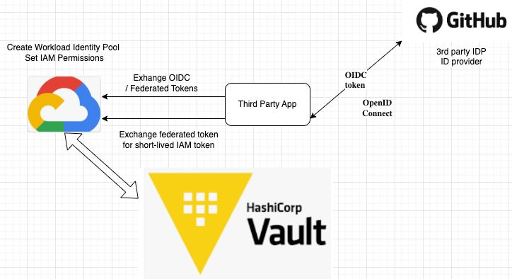

#Testing

DRAFT - NOT READY 
GCP Dynamic Secrets Engine

1. Research testing to provd out connection to dyncmic secrets in GCP.
  
2. Hashicorp Vault has GCP autheintication method that allows applications to authenticatewith Vault and fetch secrets required for deployments.   The terraform agents would be authenticating using using it's SA credentials.  Hashicorp Vault can also integrate with Kube secrets to allow applications running in GKE to pull and sync secrets in Vault and will require more reserch and testing.
  
3. GCP DYNAMIC ENGINE  
- The engine should be configured to use "Workload Identity Federation" and not setup with an account key.
- A setup in "Workload Identity Pool setup in GCP and then "identify token audience configured for the engine setup.
  
- This will require a workload identity pool setup in GCP for this and the “identity token audience” configured on the engine setup.     
- The engine “identify_token_ttl” should be set to 1 hour for now.     
- The ttl and max-ttl need to be tested with the service account key roleset type.  Guess is that max_ttl actually means nothing and rotation is based on the ttl flag.   For now we can set them to 1 hour for testing or whatever interval to facilitate testing. 
   
- Our design calls for the creation and usage of static accounts - not Dynamic. 
  
- We should test role creations with both secret types (access token, account key) 
    
- We won’t be using bindings with these roleset as the access will already be configured in GCP.     
- For testing access token types- we will need to play with setting the token_scope and will have to think how we provide that in the pipeline to Vault so that the right token scope is available to the consuming service.     

https://developer.hashicorp.com/vault/api-docs/secret/gcp#create-update-static-account 

Attributes 
- will not have handle keys
- reduces keys lasting a long time
- rotation of short lived keys 

<b>Topics to check in on</b> 
- Workload Identity Federation
- Workload Identity Pool
- OpenId connect (OIDC)

Setting the correct scope
- service account - google api 
- capabity with the "access token" will get scope
- 

Google API Scopes

For example, if the API needs to access GCS, we may have to set it with the TOKEN scope as that has the capability use the scope for getting to GCS.   If we are going to generate an access token rather than a service account key.   Service account will use the token for scope

Have to set the ability for a service account used to GCS so we have to set the correct scope for GCS 

For testing probably will need cloud platform for more general access 

<pre>
{ 
"service_account_email": "projectOwner@my-project.iam.gserviceaccount.com", "token_scopes": [ 
"https://www.googleapis.com/auth/cloud-platform", “https://www.googleapis.com/auth/bigquery”
 ], 
"ttl": "2h" 
}
</pre>

Or
<pre>
curl  \ 
      --header "X-Vault-Token: ..." \ 
      --request POST \ 
      --data @payload.json \ https://127.0.0.1:8200/v1/gcp/impersonated-account/my-token-impersonate
</pre>

Access Groups for both of us; for SSH & sudo access (required Access) 
- access to Vault
- Has been made clear; we are not to use the root token
- Azure PIM access 
- group that as root in VAULT 

Has been made clear; we are not to use the root token

